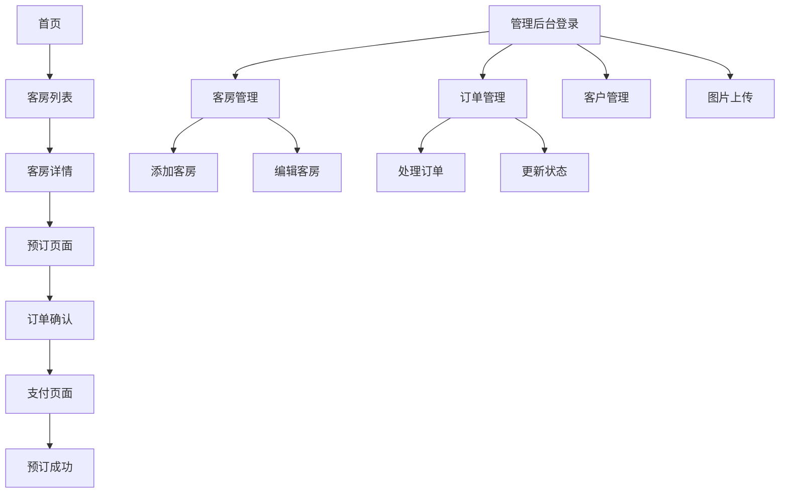

## 1. 产品概述

酒店管理系统是一个综合性的在线预订和管理平台，旨在帮助酒店管理者高效管理客房、处理预订订单、维护客户信息，同时为客人提供便捷的在线预订服务。

该系统将简化酒店日常运营流程，提高管理效率，降低运营成本，提升客户满意度。适用于中小型酒店、民宿、客栈等住宿服务提供商。

## 2. 核心功能

### 2.1 用户角色

| 角色    | 注册方式     | 核心权限                |
| ----- | -------- | ------------------- |
| 普通用户  | 手机号/邮箱注册 | 浏览客房、在线预订、查看订单、评价   |
| 酒店管理员 | 后台创建账号   | 客房管理、订单处理、客户管理、数据统计 |
| 系统管理员 | 系统初始化创建  | 用户管理、权限分配、系统配置      |

### 2.2 功能模块

酒店管理系统包含以下核心页面：

1. **首页**: 酒店介绍、客房展示、搜索筛选、热门推荐。
2. **客房列表页**: 客房分类、价格筛选、设施筛选、图片展示。
3. **客房详情页**: 详细信息、图片轮播、预订入口、用户评价。
4. **预订页面**: 日期选择、客房选择、入住人信息、价格计算。
5. **订单管理页**: 订单列表、订单状态、取消预订、订单详情。
6. **用户中心**: 个人信息、历史订单、收藏夹、评价管理。
7. **管理后台**: 客房管理、订单管理、客户管理、图片上传、数据统计。

### 2.3 页面详情

| 页面名称  | 模块名称 | 功能描述                   |
| ----- | ---- | ---------------------- |
| 首页    | 轮播图  | 展示酒店特色图片，支持自动切换和手动切换   |
| 首页    | 搜索栏  | 输入入住日期、离店日期、客房数量进行快速搜索 |
| 首页    | 客房推荐 | 展示热门客房，包含图片、价格、评分等关键信息 |
| 客房列表页 | 筛选器  | 按价格、房型、设施等条件筛选客房       |
| 客房列表页 | 客房卡片 | 展示客房缩略图、基本信息、实时价格      |
| 客房详情页 | 图片展示 | 轮播图展示客房多角度图片，支持放大查看    |
| 客房详情页 | 详细信息 | 显示房型、面积、床位、设施、价格等详细信息  |
| 客房详情页 | 预订表单 | 选择入住日期、离店日期、客人数量       |
| 预订页面  | 订单确认 | 显示预订信息、价格明细、入住人信息填写    |
| 预订页面  | 支付方式 | 支持多种支付方式选择             |
| 订单管理页 | 订单列表 | 显示所有订单，支持按状态筛选         |
| 订单管理页 | 订单详情 | 查看订单完整信息，支持取消订单        |
| 用户中心  | 个人信息 | 编辑个人资料、修改密码            |
| 用户中心  | 历史订单 | 查看历史预订记录，支持再次预订        |
| 管理后台  | 客房管理 | 添加、编辑、删除客房信息，上传图片      |
| 管理后台  | 订单管理 | 处理订单、更新订单状态、查看订单详情     |
| 管理后台  | 客户管理 | 查看客户信息、管理客户等级          |
| 管理后台  | 图片上传 | 批量上传客房图片，支持本地存储        |

## 3. 核心流程

### 用户预订流程

用户访问首页 → 搜索客房 → 浏览客房列表 → 查看客房详情 → 选择日期 → 填写预订信息 → 确认订单 → 支付 → 预订成功

### 酒店管理流程

管理员登录 → 客房管理（添加/编辑客房）→ 订单管理（处理新订单）→ 客户管理 → 数据统计分析

## 4. 用户界面设计

### 4.1 设计风格

* **主色调**: 深蓝色 (#1E3A8A) 和白色 (#FFFFFF) 为主，橙色 (#F97316) 作为强调色

* **按钮样式**: 圆角矩形设计，主要按钮使用渐变色，次要按钮使用边框样式

* **字体**: 中文使用思源黑体，英文使用Roboto，正文字号14-16px，标题字号18-24px

* **布局风格**: 卡片式布局，响应式网格系统，简洁现代风格

* **图标风格**: 使用线性图标，简洁明了，符合现代设计趋势

### 4.2 页面设计概览

| 页面名称 | 模块名称 | UI元素           |
| ---- | ---- | -------------- |
| 首页   | 导航栏  | 白色背景，包含logo、搜索 |

